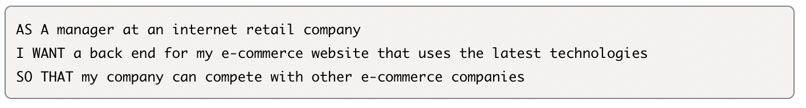

# -E-commerce-Back-End

## Description
 * E-commerce backend is a node app designed to route all CRUD functions for an E-commerce website.

## User Story




## Installation

```npm init```

``` npm install mysql2 ```

``` npm install sequelize```

``` npm install dotenv ```

## Usage 
Run the following command at the root of your project and answer the prompted questions:

``` mysql -u root -p ```

Enter PW when prompted

``` source db/schema.sql```
``` quit ```
``` npm run seed ```
``` npm start ```


## Demo Video

<p><a href="https://drive.google.com/file/d/11YniyIFPdk1ToP8_Hwjr4JHMA3iWM0K9/view
">Demonstration Video</a></p>

